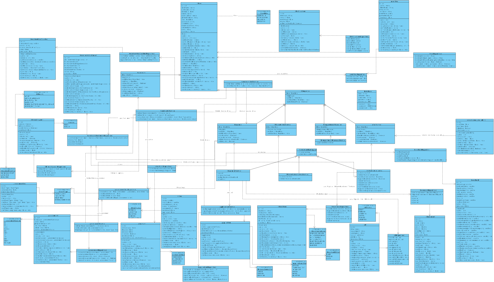

# NextHire System Architecture
> AI-Driven Smart Recruitment & Interview Management System

**⚠️ Disclaimer (Academic Requirement):**
> Please note that this initial version (v1) of the Class Diagram contains intentional design "smells" and structural inefficiencies (such as the heavy, centralized reliance on the `DatabaseController` across almost all entities). This architecture was explicitly modeled this way based on current university faculty requirements to establish a foundational understanding of the system's data flow. These anti-patterns will be refactored in upcoming iterations (v2 and potentially v3) to align with standard Object-Oriented best practices and proper Design Patterns.

- [Core Class Diagram v1](#core-class-diagram-v1)
- [Core Class Diagram v2](#core-class-diagram-v2)

--- 

## Core Class Diagram v1

<b>Core Class Diagram (v1)</b>

 

## Summary

- [Diagram Overview](#diagram-overview)
- [Downloads](#downloads)
- [System Entities & Classes](#system-entities--classes)
  - [User & Access Management](#user--access-management)
  - [Recruitment Pipeline](#recruitment-pipeline)
  - [Assessment & Evaluation](#assessment--evaluation)
  - [System Core & Logging](#system-core--logging)
- [Object Interactions](#object-interactions)

## Diagram Overview

This document provides a detailed breakdown of the NextHire system's Object-Oriented structure. The Class Diagram defines the exact attributes, methods, and visibility of the core entities, alongside the complex associations, aggregations, and inheritance models required to run the recruitment lifecycle.

## Downloads
- [Class Diagram - SVG](./NextHire-ClassDiagram-SVG-v1.svg)

## System Entities & Classes

### User & Access Management
- **`User` (Abstract/Base):** The foundational class handling core attributes (name, email, password) and authentication methods.
- **Roles (Inheritance):**
  - **`Candidate`:** Inherits from `User`. Manages profile submissions, assessment tracking, and diversity audits.
  - **`Interviewer`:** Inherits from `User`. Responsible for availability scheduling (`InterviewerAvailability`) and submitting technical `Feedback`.
  - **`HrAdmin`:** Inherits from `User`. Has elevated privileges to create jobs, manage applications, and send offers.
  - **`Employee`:** Inherits from `User`. Can interact with the system to generate referral links.

### Recruitment Pipeline
- **`Job`:** Defines the requirements, department, and current status (`DRAFT`, `PENDING`, `ACTIVE`, `CLOSED`).
- **`Application`:** The associative entity linking a `Candidate` to a `Job`. Tracks the exact application state (`APPLIED`, `TECHNICAL_TEST`, `INTERVIEW`, `OFFER`, `HIRED`).
- **`Offer` & `CounterOfferTracker`:** Handles the financial and negotiation logic. Tracks salary bounds, signing bonuses, and expiration dates.

### Assessment & Evaluation
- **`Assessment` & `Questions`:** Manages the technical test parameters, including supported programming languages (Java, Python, C++, TS, etc.) and difficulty scaling.
- **`AssessmentLog`:** A security and tracking class that monitors candidate behavior during tests (e.g., logging `TAB_SWITCH`, `FOCUS_LOSS`, and `HEARTBEAT`).
- **`Feedback`:** A detailed rubric class instantiated by Interviewers. It calculates a normalized score based on problem-solving, code cleanliness, and architectural understanding.

### System Core & Logging
- **`DatabaseController`:** The central DAO (Data Access Object) responsible for managing SQL queries, database connections, and persistence across all active system objects.
- **`AuditLog`:** Tracks every major action (Insert, Update, Delete) performed by any user role for security and administrative review.

## Object Interactions

1. **Job Creation:** An `HrAdmin` instantiates a new `Job` object, setting required skills and status.
2. **Application Flow:** A `Candidate` creates an `Application` linked to a specific `Job`.
3. **Evaluation Phase:** The `Application` triggers the creation of an `Assessment`. During the test, the `AssessmentLog` actively records the session.
4. **Interview Scheduling:** If the assessment score is sufficient, an `Interview` object is mapped between the `Candidate` and an `Interviewer` based on the `InterviewerAvailability` matrix.
5. **Final Decision:** Post-interview, the `Interviewer` generates a `Feedback` object. The `HrAdmin` reviews this data and generates an `Offer` object.
6. **Persistence:** Throughout this entire lifecycle, the `DatabaseController` is invoked to persist state changes, while the `AuditLog` records the history of these transactions.

---

## Core Class Diagram v2

<b>Core Class Diagram (v2)</b>

  
 

> **Note:** Don't worry, we are working and learning to make the most professional work 😊.

---

  <strong>FCAI – Capital University (Formerly Helwan University)</strong> 
  Software Engineering 1 · CS-251 · Final Project · 2025/2026 
   
  © 2026 <strong>NextHire Team</strong>. All Rights Reserved. 
  Released under the <a href="https://github.com/abdelhalimyasser/NextHire-AI-Driven-Smart-Recruitment-Interview-Management-System/blob/main/LICENSE"><code>LICENSE</code></a>.

