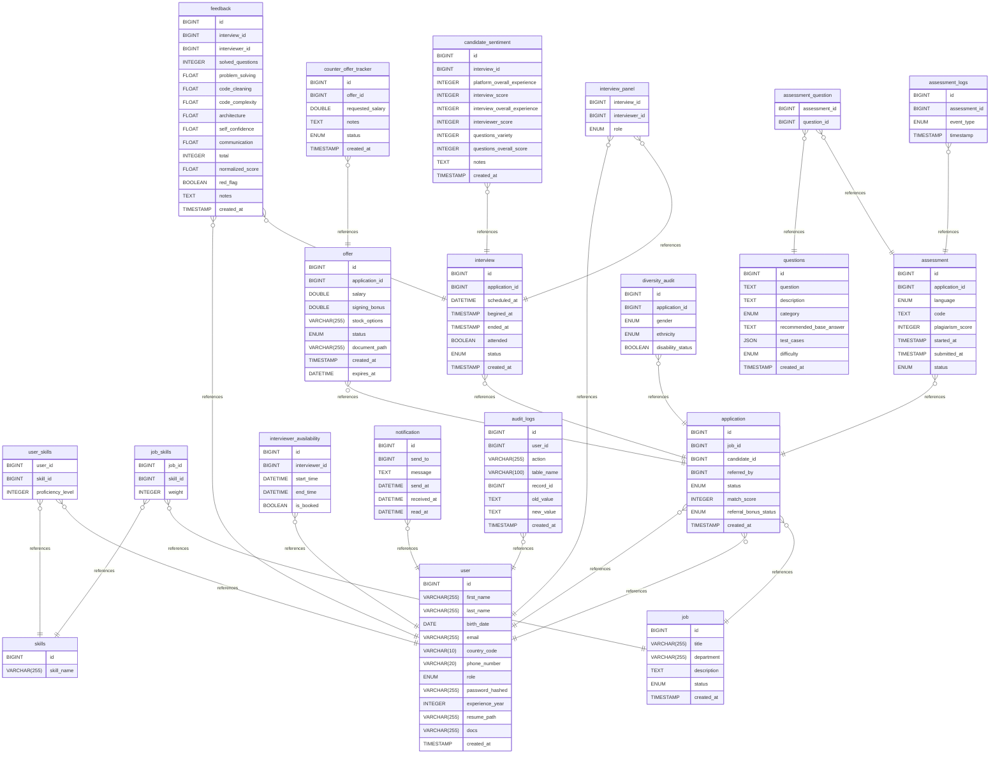

# NextHire ERD for DataBase
> AI Driven Smart Recruitment Interview Management System
## Summary

- [Database Type](#database-type)
- [Download ERD](#downloads)
- [Table Structure](#table-structure)
	- [user](#user)
	- [skills](#skills)
	- [user_skills](#user_skills)
	- [job](#job)
	- [job_skills](#job_skills)
	- [application](#application)
	- [questions](#questions)
	- [assessment](#assessment)
	- [assessment_question](#assessment_question)
	- [assessment_logs](#assessment_logs)
	- [interviewer_availability](#interviewer_availability)
	- [interview](#interview)
	- [interview_panel](#interview_panel)
	- [feedback](#feedback)
	- [offer](#offer)
	- [counter_offer_tracker](#counter_offer_tracker)
	- [diversity_audit](#diversity_audit)
	- [notification](#notification)
	- [candidate_sentiment](#candidate_sentiment)
	- [audit_logs](#audit_logs)
- [Relationships](#relationships)
- [Database Diagram](#database-diagram)

## Database type

- **Database system:** MySQL
## Downloads
- [PDF](./NextHire-DOCS-ERD-PDF.pdf)
- [Png](./NextHire-ERD-PNG.png)

## Table structure

### user

| Name        | Type          | Settings                      | References                    | Note                           |
|-------------|---------------|-------------------------------|-------------------------------|--------------------------------|
| **id** | BIGINT | 🔑 PK, not null, unique |  | |
| **first_name** | VARCHAR(255) | not null |  | |
| **last_name** | VARCHAR(255) | not null |  | |
| **birth_date** | DATE | not null |  | |
| **email** | VARCHAR(255) | not null, unique |  | |
| **country_code** | VARCHAR(10) | not null |  | |
| **phone_number** | VARCHAR(20) | not null, unique |  | |
| **role** | ENUM | not null, default: Candidate |  | |
| **password_hashed** | VARCHAR(255) | not null |  | |
| **experience_year** | INTEGER | not null, default: 0 |  | |
| **resume_path** | VARCHAR(255) | null |  | |
| **docs** | VARCHAR(255) | null |  | |
| **created_at** | TIMESTAMP | null, default: CURRENT_TIMESTAMP |  | | 

#### Enums
##### role

- Candidate
- Interviewer
- HR Admin

### skills

| Name        | Type          | Settings                      | References                    | Note                           |
|-------------|---------------|-------------------------------|-------------------------------|--------------------------------|
| **id** | BIGINT | 🔑 PK, not null, unique, autoincrement |  | |
| **skill_name** | VARCHAR(255) | not null, unique |  | | 

### user_skills

| Name        | Type          | Settings                      | References                    | Note                           |
|-------------|---------------|-------------------------------|-------------------------------|--------------------------------|
| **user_id** | BIGINT | 🔑 PK, not null | fk_user_skills_user_id_user | |
| **skill_id** | BIGINT | 🔑 PK, not null | fk_user_skills_skill_id_skills | |
| **proficiency_level** | INTEGER | null, default: 1 |  | | 

### job

| Name        | Type          | Settings                      | References                    | Note                           |
|-------------|---------------|-------------------------------|-------------------------------|--------------------------------|
| **id** | BIGINT | 🔑 PK, not null, unique, autoincrement |  | |
| **title** | VARCHAR(255) | not null |  | |
| **department** | VARCHAR(255) | not null |  | |
| **description** | TEXT | not null |  | |
| **status** | ENUM | not null, default: Draft |  | |
| **created_at** | TIMESTAMP | null, default: CURRENT_TIMESTAMP |  | | 

#### Enums
##### status

- Draft
- Pending Approval
- Active
- Closed
- Archived

### job_skills

| Name        | Type          | Settings                      | References                    | Note                           |
|-------------|---------------|-------------------------------|-------------------------------|--------------------------------|
| **job_id** | BIGINT | 🔑 PK, not null | fk_job_skills_job_id_job | |
| **skill_id** | BIGINT | 🔑 PK, not null | fk_job_skills_skill_id_skills | |
| **weight** | INTEGER | not null, default: 1 |  |Dynamic Skill-Weighting (1-5) | 

### application

| Name        | Type          | Settings                      | References                    | Note                           |
|-------------|---------------|-------------------------------|-------------------------------|--------------------------------|
| **id** | BIGINT | 🔑 PK, not null, autoincrement |  | |
| **job_id** | BIGINT | not null | fk_application_job_id_job | |
| **candidate_id** | BIGINT | not null | fk_application_candidate_id_user | |
| **referred_by** | BIGINT | null | fk_application_referred_by_user | |
| **status** | ENUM | not null, default: Applied |  | |
| **match_score** | INTEGER | not null, default: 0 |  | |
| **referral_bonus_status** | ENUM | null, default: Not Applicable |  | |
| **created_at** | TIMESTAMP | null, default: CURRENT_TIMESTAMP |  | | 

#### Enums
##### status

- Applied
- Technical Test
- Interview
- Offer
- Hired
- Rejected
##### referral_bonus_status

- Pending
- Paid
- Not Applicable

### questions

| Name        | Type          | Settings                      | References                    | Note                           |
|-------------|---------------|-------------------------------|-------------------------------|--------------------------------|
| **id** | BIGINT | 🔑 PK, not null, autoincrement |  | |
| **question** | TEXT | not null |  | |
| **description** | TEXT | not null |  | |
| **category** | ENUM | not null, default: problem solving |  | |
| **recommended_base_answer** | TEXT | null |  | |
| **test_cases** | JSON | not null |  |handel the output of the question |
| **difficulty** | ENUM | not null, default: easy |  | |
| **created_at** | TIMESTAMP | null, default: CURRENT_TIMESTAMP |  | | 

#### Enums
##### category

- problem solving
- data engineering
- data science
- data analysis
- machine learning
- deep learning
- backend
##### difficulty

- easy
- medium
- hard

### assessment

| Name        | Type          | Settings                      | References                    | Note                           |
|-------------|---------------|-------------------------------|-------------------------------|--------------------------------|
| **id** | BIGINT | 🔑 PK, not null, autoincrement |  | |
| **application_id** | BIGINT | not null | fk_assessment_application_id_application | |
| **language** | ENUM | not null, default: python |  | |
| **code** | TEXT | null |  | |
| **plagiarism_score** | INTEGER | null, default: 0 |  | |
| **started_at** | TIMESTAMP | not null |  | |
| **submitted_at** | TIMESTAMP | not null |  | |
| **status** | ENUM | null, default: Pending |  | | 

#### Enums
##### language

- c
- c++
- java
- python
- c#
- php
- js
- ts
- go
- rust
##### status

- Pending
- In Progress
- Completed
- Expired

### assessment_question

| Name        | Type          | Settings                      | References                    | Note                           |
|-------------|---------------|-------------------------------|-------------------------------|--------------------------------|
| **assessment_id** | BIGINT | 🔑 PK, not null | fk_assessment_question_assessment_id_assessment | |
| **question_id** | BIGINT | 🔑 PK, not null | fk_assessment_question_question_id_questions | | 

### assessment_logs

| Name        | Type          | Settings                      | References                    | Note                           |
|-------------|---------------|-------------------------------|-------------------------------|--------------------------------|
| **id** | BIGINT | 🔑 PK, not null, unique, autoincrement |  | |
| **assessment_id** | BIGINT | not null | fk_assessment_logs_assessment_id_assessment | |
| **event_type** | ENUM | not null |  | |
| **timestamp** | TIMESTAMP | null, default: CURRENT_TIMESTAMP |  | | 

#### Enums
##### event_type

- focus_loss
- tab_switch
- heartbeat
- error
- submission

### interviewer_availability

| Name        | Type          | Settings                      | References                    | Note                           |
|-------------|---------------|-------------------------------|-------------------------------|--------------------------------|
| **id** | BIGINT | 🔑 PK, not null, autoincrement |  | |
| **interviewer_id** | BIGINT | not null | fk_interviewer_availability_interviewer_id_user | |
| **start_time** | DATETIME | not null |  | |
| **end_time** | DATETIME | not null |  | |
| **is_booked** | BOOLEAN | null, default: false |  | | 

### interview

| Name        | Type          | Settings                      | References                    | Note                           |
|-------------|---------------|-------------------------------|-------------------------------|--------------------------------|
| **id** | BIGINT | 🔑 PK, not null, unique, autoincrement |  | |
| **application_id** | BIGINT | not null | fk_interview_application_id_application | |
| **scheduled_at** | DATETIME | not null |  | |
| **begined_at** | TIMESTAMP | not null |  | |
| **ended_at** | TIMESTAMP | not null |  | |
| **attended** | BOOLEAN | null, default: false |  | |
| **status** | ENUM | null, default: Scheduled |  | |
| **created_at** | TIMESTAMP | null, default: CURRENT_TIMESTAMP |  | | 

#### Enums
##### status

- Scheduled
- In Progress
- Completed
- Canceled

### interview_panel

| Name        | Type          | Settings                      | References                    | Note                           |
|-------------|---------------|-------------------------------|-------------------------------|--------------------------------|
| **interview_id** | BIGINT | 🔑 PK, not null | fk_interview_panel_interview_id_interview | |
| **interviewer_id** | BIGINT | 🔑 PK, not null | fk_interview_panel_interviewer_id_user | |
| **role** | ENUM | not null, default: Technical |  | | 

#### Enums
##### role

- Lead
- Technical
- HR
- Shadow

### feedback

| Name        | Type          | Settings                      | References                    | Note                           |
|-------------|---------------|-------------------------------|-------------------------------|--------------------------------|
| **id** | BIGINT | 🔑 PK, not null, unique, autoincrement |  | |
| **interview_id** | BIGINT | not null | fk_feedback_interview_id_interview | |
| **interviewer_id** | BIGINT | not null | fk_feedback_interviewer_id_user | |
| **solved_questions** | INTEGER | not null |  | |
| **problem_solving** | FLOAT | not null, default: 0 |  | |
| **code_cleaning** | FLOAT | not null, default: 0 |  | |
| **code_complexity** | FLOAT | not null, default: 0 |  | |
| **architecture** | FLOAT | not null, default: 0 |  | |
| **self_confidence** | FLOAT | not null, default: 0 |  | |
| **communication** | FLOAT | not null, default: 0 |  | |
| **total** | INTEGER | not null |  | |
| **normalized_score** | FLOAT | null |  |Adjusted for interviewer harshness |
| **red_flag** | BOOLEAN | null, default: false |  |للتصعيد السريع لـ HR |
| **notes** | TEXT | not null |  | |
| **created_at** | TIMESTAMP | null, default: CURRENT_TIMESTAMP |  | | 

### offer

| Name        | Type          | Settings                      | References                    | Note                           |
|-------------|---------------|-------------------------------|-------------------------------|--------------------------------|
| **id** | BIGINT | 🔑 PK, not null |  | |
| **application_id** | BIGINT | not null | fk_offer_application_id_application | |
| **salary** | DOUBLE | not null |  | |
| **signing_bonus** | DOUBLE | not null, default: 0 |  | |
| **stock_options** | VARCHAR(255) | not null, default: 0 |  | |
| **status** | ENUM | not null, default: Pending |  | |
| **document_path** | VARCHAR(255) | null |  |Digital Offer-Letter Generator |
| **created_at** | TIMESTAMP | null, default: CURRENT_TIMESTAMP |  | |
| **expires_at** | DATETIME | not null |  | | 

#### Enums
##### status

- Pending
- Accepted
- Rejected
- Expired
- Negotiating

### counter_offer_tracker

| Name        | Type          | Settings                      | References                    | Note                           |
|-------------|---------------|-------------------------------|-------------------------------|--------------------------------|
| **id** | BIGINT | 🔑 PK, not null, autoincrement |  | |
| **offer_id** | BIGINT | not null | fk_counter_offer_tracker_offer_id_offer | |
| **requested_salary** | DOUBLE | not null |  | |
| **notes** | TEXT | null |  | |
| **status** | ENUM | null, default: Pending Review |  | |
| **created_at** | TIMESTAMP | null, default: CURRENT_TIMESTAMP |  | | 

#### Enums
##### status

- Pending Review
- Approved
- Declined

### diversity_audit

| Name        | Type          | Settings                      | References                    | Note                           |
|-------------|---------------|-------------------------------|-------------------------------|--------------------------------|
| **id** | BIGINT | 🔑 PK, not null, autoincrement |  | |
| **application_id** | BIGINT | not null | fk_diversity_audit_application_id_application | |
| **gender** | ENUM | not null, default: Prefer Not to Say |  | |
| **ethnicity** | ENUM | not null, default: Prefer not to say |  | |
| **disability_status** | BOOLEAN | not null, default: 0 |  | | 

#### Enums
##### gender

- Male
- Female
- Prefer Not to Say
##### ethnicity

- Asian
- African or African American
- Hispanic or Latino
- Caucasian
- Middle Eastern or North African - MENA
- Prefer not to say

### notification

| Name        | Type          | Settings                      | References                    | Note                           |
|-------------|---------------|-------------------------------|-------------------------------|--------------------------------|
| **id** | BIGINT | 🔑 PK, not null, unique, autoincrement |  | |
| **send_to** | BIGINT | not null | fk_notification_send_to_user | |
| **message** | TEXT | not null |  | |
| **send_at** | DATETIME | not null |  | |
| **received_at** | DATETIME | not null |  | |
| **read_at** | DATETIME | not null |  | | 

### candidate_sentiment

| Name        | Type          | Settings                      | References                    | Note                           |
|-------------|---------------|-------------------------------|-------------------------------|--------------------------------|
| **id** | BIGINT | 🔑 PK, not null, autoincrement |  | |
| **interview_id** | BIGINT | null | fk_candidate_sentiment_interview_id_interview | |
| **platform_overall_experience** | INTEGER | null |  | |
| **interview_score** | INTEGER | null |  | |
| **interview_overall_experience** | INTEGER | null |  | |
| **interviewer_score** | INTEGER | null |  | |
| **questions_variety** | INTEGER | null |  | |
| **questions_overall_score** | INTEGER | null |  | |
| **notes** | TEXT | null |  | |
| **created_at** | TIMESTAMP | null, default: CURRENT_TIMESTAMP |  | | 

### audit_logs

| Name        | Type          | Settings                      | References                    | Note                           |
|-------------|---------------|-------------------------------|-------------------------------|--------------------------------|
| **id** | BIGINT | 🔑 PK, not null, unique, autoincrement |  | |
| **user_id** | BIGINT | not null | fk_audit_logs_user_id_user | |
| **action** | VARCHAR(255) | not null |  | |
| **table_name** | VARCHAR(100) | not null |  | |
| **record_id** | BIGINT | not null |  | |
| **old_value** | TEXT | null |  | |
| **new_value** | TEXT | null |  | |
| **created_at** | TIMESTAMP | null, default: CURRENT_TIMESTAMP |  | | 

## Relationships

- **user_skills to user**: many_to_one
- **user_skills to skills**: many_to_one
- **job_skills to job**: many_to_one
- **job_skills to skills**: many_to_one
- **application to job**: many_to_one
- **application to user**: many_to_one
- **application to user**: many_to_one
- **assessment to application**: many_to_one
- **assessment_question to assessment**: many_to_one
- **assessment_question to questions**: many_to_one
- **assessment_logs to assessment**: many_to_one
- **interviewer_availability to user**: many_to_one
- **interview to application**: many_to_one
- **interview_panel to interview**: many_to_one
- **interview_panel to user**: many_to_one
- **feedback to interview**: many_to_one
- **feedback to user**: many_to_one
- **offer to application**: many_to_one
- **counter_offer_tracker to offer**: many_to_one
- **diversity_audit to application**: many_to_one
- **notification to user**: many_to_one
- **candidate_sentiment to interview**: many_to_one
- **audit_logs to user**: many_to_one

## Database Diagram

---

  <strong>FCAI – Capital University ~ (Formerly Helwan University)</strong> 
  Software Engineering 1 · CS-251 · Final Project · 2025/2026 
   
  © 2026 <strong>NextHire Team</strong>. All Rights Reserved. 
  Released under the <a href="https://github.com/abdelhalimyasser/NextHire-AI-Driven-Smart-Recruitment-Interview-Management-System/blob/main/LICENSE"><code>LICENSE</code></a>.

