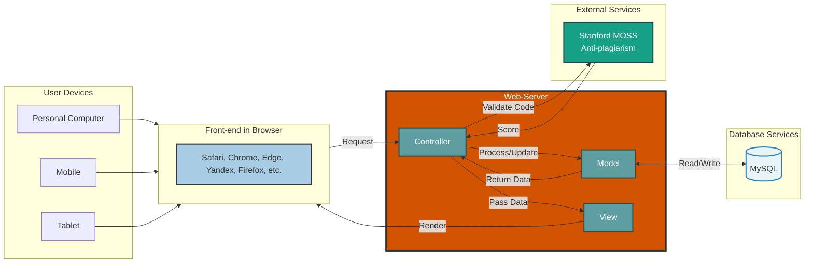

# NextHire System Architecture
> AI Driven Smart Recruitment & Interview Management System

## Summary

- [Architecture Overview](#architecture-overview)
- [Download System Architecture](#downloads)
- [System Components](#system-components)
  - [Client Tier (Front-end)](#client-tier-front-end)
  - [Application Tier (Web-Server)](#application-tier-web-server)
  - [Data Tier (Database)](#data-tier-database)
  - [External Services](#external-services)
- [Data Flow](#data-flow)
- [Architecture Diagram](#architecture-diagram)

## Architecture Overview

This document outlines the high-level system architecture for **NextHire**. The system is built upon a standard monolithic Model-View-Controller (MVC) design pattern, ensuring a clean separation of concerns between user interface, routing logic, and data management.

## Downloads
- [PDF](./NextHire-DOCS-SystemArchitecture-PDF.pdf)
- [Png](./NextHire-SystemArchitecture-PNG.png)

## System Components

### Client Tier (Front-end)
- **Target Users:** Candidates, Interviewers, HR Admins, and Employees.
- **Supported Devices:** Personal Computers, Mobile Phones, and Tablets.
- **Browsers:** Fully compatible with major modern web browsers (Safari, Google Chrome, Microsoft Edge, Yandex, Mozilla Firefox, etc.).

### Application Tier (Web-Server)
The core logic resides within the Web-Server, structured into three primary MVC components:
- **Controller:** Acts as the central traffic router. It receives incoming HTTP requests from the client's browser, processes input parameters, coordinates with external APIs (like Stanford MOSS), and dictates the workflow to the Model and View.
- **Model:** The core data engine. It encapsulates all business logic and rules, communicating directly with the Database Services to perform queries and structural data updates.
- **View:** The presentation layer. It receives processed data from the Controller and renders the final user interface that is returned to the client's browser.

### Data Tier (Database)
- **Database Engine:** MySQL.
- **Function:** Persistent, relational storage for all system entities including user records, job applications, assessment logs, and interview feedback.

### External Services
- **Stanford MOSS (Anti-Plagiarism):** A critical external integration used to detect code similarity. The Web-Server communicates with this service to automatically analyze candidate technical assessment submissions.

## Data Flow

1. The **User** interacts with the application interface on their device.
2. The **Front-end Browser** dispatches a request to the **Controller**.
3. If data retrieval or modification is required, the **Controller** invokes the **Model**.
4. During code assessments, the **Controller** transmits submission data to **Stanford MOSS** to retrieve a plagiarism score.
5. The **Model** executes the necessary queries against the **MySQL Database** and returns the structured data to the **Controller**.
6. The **Controller** passes the final dataset to the **View**.
7. The **View** renders the HTML/UI components and returns the response to the user's **Browser**.

## Architecture Diagram

---

  <strong>FCAI – Capital University ~ (Formerly Helwan University)</strong> 
  Software Engineering 1 · CS-251 · Final Project · 2025/2026 
   
  © 2026 <strong>NextHire Team</strong>. All Rights Reserved. 
  Released under the <a href="https://github.com/abdelhalimyasser/NextHire-AI-Driven-Smart-Recruitment-Interview-Management-System/blob/main/LICENSE"><code>LICENSE</code></a>.

